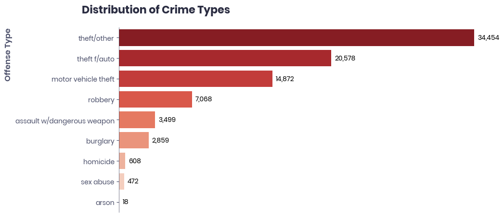
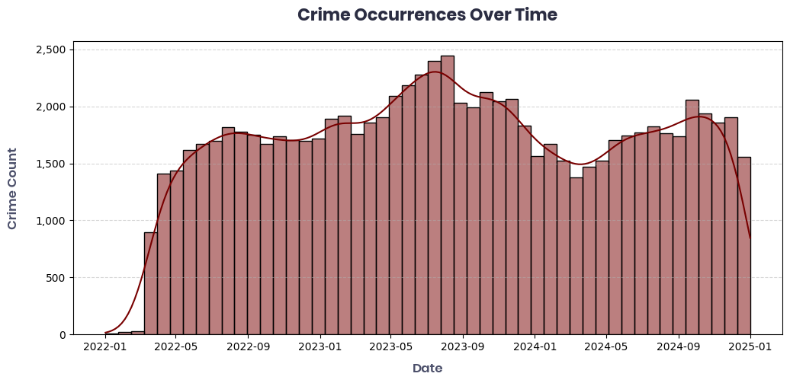
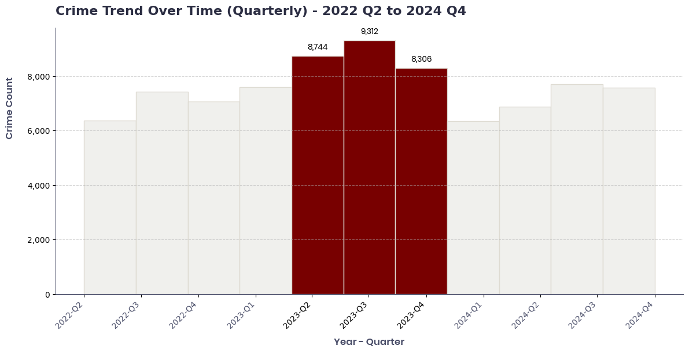
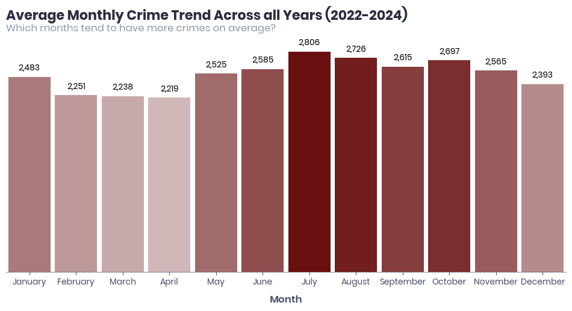
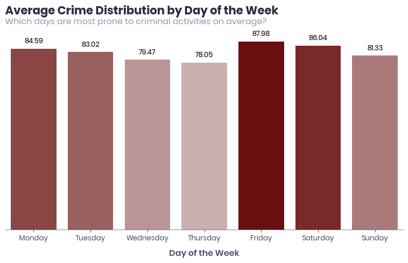
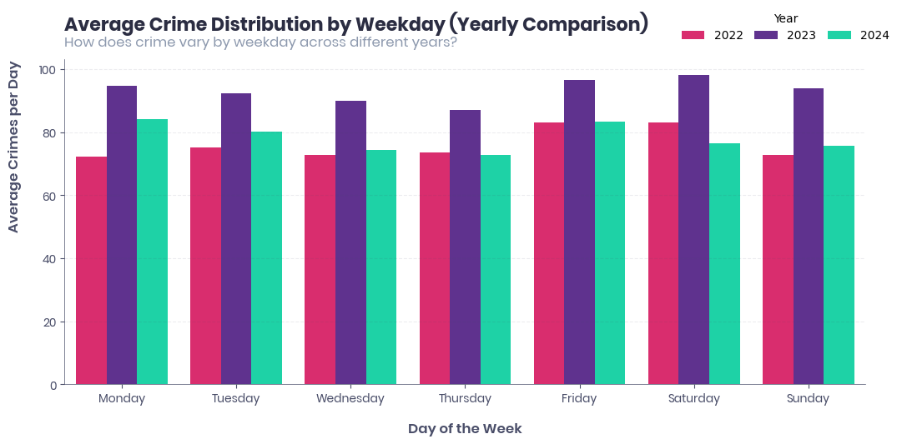
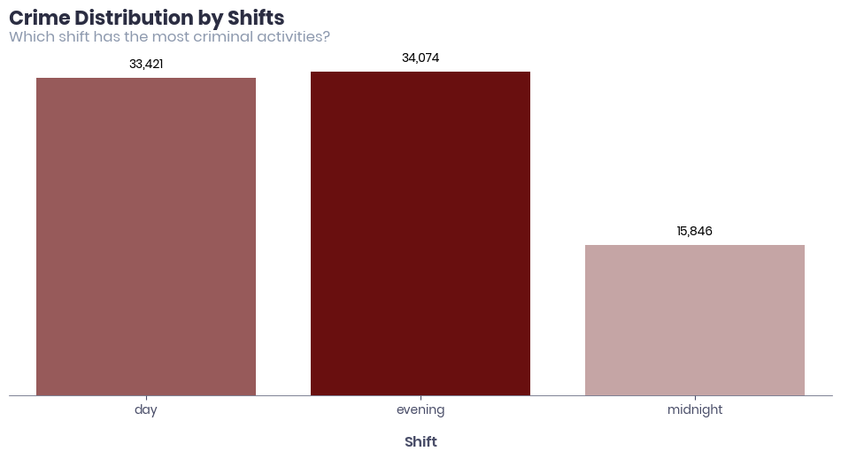
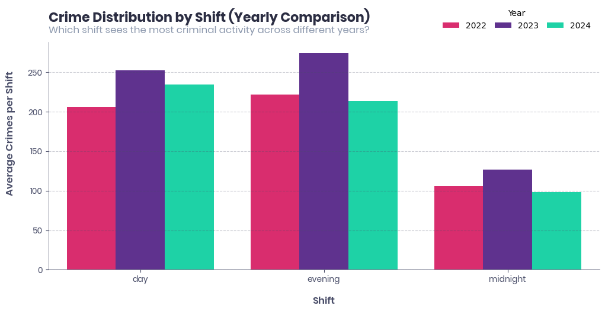
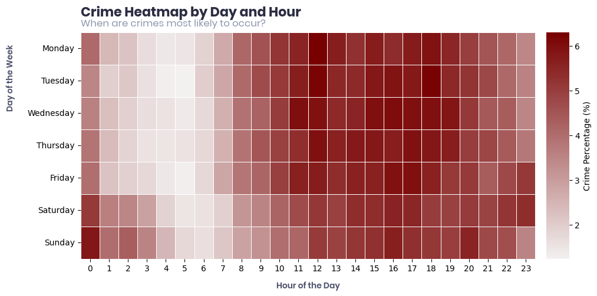

# Exploring Crime in Washington, D.C.: A Deep Dive into the Data
## Introduction
Exploratory Data Analysis (EDA) - or, in the spirit of this project, an investigation (see what we did there?). Much like detectives analyzing a crime scene, EDA helps uncover hidden patterns, trends, and anomalies in the data. By leveraging visualizations and statistical summaries, we can extract meaningful insights that will guide our deeper analysis and predictive modeling.
In this project, we'll explore crime trends across different dimensions, including temporal patterns, crime category distributions, and geospatial insights. These findings will not only enhance our understanding of crime distribution but also contribute to data-driven decision-making for law enforcement and policymakers.<br>

### Outline
- **General Overview** - A high-level summary of crime occurrences.
- **Time Trends** - Identifying crime patterns across different hours, days, and years.
- **Category-Based Analysis** - Examining which types of crimes are most prevalent.
- **Geospatial Analysis** - Examining crime occurance by location

By the end of this analysis, we will have a clearer picture of when, how, where, and what crimes are most likely to occur in Washington, D.C. This will lay the foundation for predictive modeling and data-driven policy recommendations in future analyses.

## General Overview
The dataset contains key details about crime occurrences, including timestamps, locations, and offense types. Notably:
Missing END_DATE values are treated as ongoing cases.
Missing BID values indicate areas that do not belong to any Business Improvement District (BID), making them Missing Not At Random (MNAR).

### Crime Type Distribution
A quick look at the distribution of crime types gives us an idea of which offenses are most common in Washington, D.C.:

- We expect certain offenses (e.g., theft, assault) to dominate, but are there any surprising trends?
- Understanding crime frequency helps prioritize law enforcement strategies.
### Temporal Spread of Crimes
Before diving into detailed time trends, let's visualize the overall distribution of crimes over time:

- This will help spot periods of high or low crime activity.
- We might identify seasonal trends or data inconsistencies.
- We would also remove the first quarter of 2022 as it will skew our analysis

```python
cleaned_df["Year_Quarter"] = cleaned_df["START_DATE"].dt.to_period("Q")
cleaned_df = cleaned_df.loc[(cleaned_df['Year_Quarter'] != "2022Q1")] 
```
---
## Temporal Trend
To begin our time-based analysis, we'll start from the highest level of granularity: quarterly trends. Given that our dataset spans only three years, a quarter-level view helps us smooth out short-term fluctuations and highlight longer-term patterns.
### Quarterly Crime Trend (2022 Q2–2024 Q4)

The chart reveals a noticeable spike in crime counts during the middle of the observed period. Specifically:
- 2023-Q2 recorded 8,741 crimes
- 2023-Q3 saw the highest count at 9,308 crimes
- 2023-Q4 remained elevated at 8,302 crimes

These three quarters deviate significantly from the overall trend, suggesting a temporary surge in criminal activity during that year.<br>
Outside of these high-crime quarters, the crime rate stabilizes around an average of 7,000 crimes per quarter.  This spike could stem from a combination of seasonal factors, policy changes, economic shifts, or social unrest. Further investigation would be required to understand the root causes.
### Monthly Trend Overview

The above line chart compares monthly crime trends from 2022 Q2 till 2024: 
- In 2022, crime trends rose from ~2,000 in April to a pick in July and August, with ~2,500 before going for a steep decline.
- In 2023, crime levels fluctuated between 2,450 and 3,350 cases monthly, peaking in July (3,350 cases) and tapering off towards December.
- In 2024, crime counts started lower, with the lowest point in March (~2,050 cases). A gradual increase followed, reaching a relative peak in September and October (~2,700 cases), but never surpassing the 2023 levels.
<p>Across 2022 and 2023, a clear seasonal pattern emerges: crime tends to increase from spring, peaking in summer (July–August), before declining towards the end of the year. Which 2024 shows a peak in crime rate around September</p>

### Average Monthly Trend

When averaged across both years, we observe:
- July consistently records the highest average crime count (2,806 cases), marking it as the peak crime month. possibly due to a spike in 2023
- August (2,724 cases) and October (2,696 cases) also show elevated crime levels.
- April (2,219 cases) and March (2,236 cases) have the lowest average crime counts, suggesting a seasonal dip.

These patterns reinforce a clear seasonal trend - crime tends to surge during the summer months (July–August) and decrease during spring and late winter.

### Daily Crime Trend Overview

This bar chart illustrates the average distribution of crimes across each day of the week:
- Friday records the highest average crime rate (87.94 cases), followed closely by Saturday (86.00 cases).
- Crime levels gradually decrease as the week progresses, with the lowest crime rate observed on Thursday (78.00 cases).
- Monday (84.55 cases) and Tuesday (82.97 cases) show relatively elevated crime rates, suggesting potential spillover effects from weekend activities.
- Sunday (81.30 cases) reflects a slight decline from the weekend peak but remains higher than midweek days.

This pattern reveals a clear weekly cycle in crime occurrence, with activity peaking towards the end of the work week and over the weekend, then tapering off midweek.

### Yearly Comparison of Daily Crime Trends

This grouped bar chart compares average daily crime trends across 2022, 2023, and 2024:
- 2023 consistently recorded the highest crime levels across all weekdays, peaking notably on Fridays and Saturdays.
- In contrast, 2024 showed a general decline in crime levels across all days, though crime remained relatively high on weekends.
- 2022's crime levels were consistently lower than in 2023 but similar to 2024, except for a noticeable rise on Fridays and Saturdays.

Across all years, the same weekday pattern persisted: crime levels rise towards the weekend, dip midweek, and increase again on Fridays and Saturdays.

### Hourly Trend

The bar chart above shows the total number of crime incidents recorded across three police shifts: Day (8 AM - 4 PM), Evening (4 PM - 12 AM), and Midnight (12 AM - 8 AM).
- The Evening shift reported the highest number of crimes (34,048 incidents), followed closely by the Day shift (33,410 incidents).
- The Midnight shift recorded the lowest crime count (15,840 incidents).

This pattern suggests that most crimes occur between 8 AM and midnight, with relatively fewer incidents during late-night and early-morning hours.


To examine whether this shift-based pattern is consistent over time, I compared the average number of crimes per shift across 2022, 2023, and 2024.
The chart shows that:
- The Evening shift consistently had the highest crime average each year.
- Day shift followed a similar trend, with slightly lower numbers.
- Midnight shift remained the least active.

The year 2023 experienced slightly higher crime averages across all shifts, indicating a temporary rise in crime activity compared to 2022 and 2024.


To further explore when crimes are most likely to occur, I plotted a heatmap showing crime distribution by hour of the day and day of the week.
- Crime activity increases from 8 AM and remains high until approximately 10 PM.
- The highest crime intensity is concentrated between 12 PM and 8 PM.
- Crime rates decline after 10 PM and remain low during early-morning hours (12 AM - 6 AM).
- Weekend nights (Saturday night - Sunday early morning) show slightly higher activity, particularly between 10 PM and 2 AM.


Finally, I analyzed how crime fluctuates by hour across different years.
The line chart indicates:
- Crime activity remains low between 12 AM and 6 AM each year.
- There is a steady increase from 8 AM onwards, with peaks between 12 PM and 8 PM.
- 2022 shows slightly higher spikes during early morning hours (12 AM - 2 AM) compared to 2023 and 2024.
- Evening crime activity was more stable in 2024, while **2023 displayed more fluctuations in the evening hours.